# Animal Jam Application Design Document

This document provides details on the different design components of the Animal Jam Application.  The application implements some common features that a user requires to manage a list of records.

## Application Feature List
The following features have been implemented in the application:

* Graphical user interface using Java Swing classes.
* Load and display a collection of animal record items.
* Add and remove items to the favorite list.
* Save favorite list to a file using XML, JSON, TXT or CSV formats.
* Search the collection based on name of animals.
* Filter the collection database using different fields of the database
* Sort the filtered list using different fields of the database

## Application Design Implementation Details

The Animal Jam applicaton uses the Model-View-Controller design pattern to implement different components of the application.  The View component launches the GUI component of the application.  It provides all the user interface capabilites of the application.  The Model component manages all the data related tasks like managing the database and the favorite list.  The Controller is responsible to interact with model based on user input from the View component.

### View Component Details

The view component has the main class that launches the Graphical User Interface (GUI).  When the applicaton launches it shows the user the list of animals in the collection.  The users have the ability to select items from the initial collection list and them to the favorite list.  They can also filter the collection using the fields of the database.  Users can switch between viewing the original collection or the favorite list.  They can also save the favorite list in XML, JSON or CSV file formats.

The View component calls the Controller component when it needs to perform actions based on the input from the user via buttons or text fields.  For example, when the user want to look at the favorite list and clicks the button to view the list, view component will call the controller method to get the favorite list from the model and display the content for the user in the View component table. 

### Model Component details

The model component is responsible to maintain the database and favorite list.  The model loads in the initial database from a file at data/sample.csv.  The application can be modified to provide a different database file that has the required fields.  Model provides an interface that the Controller component can use to get the Collection data or data in favorite list.  The model interface also provides methods to add and remove items from the favorite list and to save the favorite list to an output file using JSON, XML, TXT or CSV formats.

### Controller Component details

The controller component maintains the filtered list for the view to display to the user.  The controller provides an interface for the view to utilize and get responses from the model based on user requirements.  The controller interface has methods to get data of all the various lists that view displays to the user.  It also provides view with methods to add and remove items from the favorite list and save the favorite list to a file provided by the user. 

## Unit Testing Details

Each of the Model-View-Controller components were testing using unit level tests.

* The GUI testing screenshots can be found in the [AnimalJamGuiTesting](AnimalJamGuiTesting.md) file.
* The Model components unit level testing details can be found in the [AnimalJamModelTesting](AnimalJamModelTesting.md) file
* The Controller components unit level testing details can be found in the [AnimalJamControllerTesting](AnimalJamControllerTesting.md) file

## Final UML Class Diagram

```mermaid
---
title:  Animal Jam UML
---
classDiagram
    AnimalJamApp --> IAnimalController : uses
    AnimalJamApp --> IAnimalModel : uses
    AnimalJamApp --> IView : uses
    IAnimalController <|-- AnimalJamController
    IView <|-- AnimalJamGUI
    IAnimalModel <|-- AnimalJamModel
    AnimalJamModel --> AnimalRecord : uses
    AnimalJamModel --> Formats : uses
    AnimalJamModel --> DataFormater : uses
    AnimalJamModel --> InputReader : uses
    DataFormater --> AnimalXmlWrapper : uses
    InputReader --> AnimalInfo : uses
    AnimalJamController --> IAnimalModel : uses
    AnimalJamController --> Formats : uses
    AnimalJamController --> Operations : uses
    AnimalJamController --> Filter : uses
    AnimalJamController --> Sort : uses
    AnimalJamController --> Columns : uses
    AnimalJamController --> ListTypes : uses
    AnimalJamGUI --> IAnimalController : uses
    AnimalJamGUI --> AnimalJamCollectionDisplay : uses
    AnimalJamGUI --> DisplayUtils : uses
    AnimalJamGUI --> AnimalRecord : uses
    AnimalJamCollectionDisplay --> ListTypes : uses
    AnimalJamCollectionDisplay --> IAnimalController : uses
    AnimalJamCollectionDisplay --> CollectionAL : uses
    CollectionAL --> IAnimalController : uses
    CollectionAL --> AnimalJamCollectionDisplay : uses
    CollectionAL --> AnimalJamFilterDisplay : uses
    CollectionAL --> AnimalJamSortDisplay : uses
    CollectionAL --> AnimalJamSaveDisplay : uses
    CollectionAL --> ListTypes : uses
    CollectionAL --> AnimalRecord : uses
    CollectionAL --> DisplayUtils : uses
    AnimalJamFilterDisplay --> IAnimalController : uses
    AnimalJamFilterDisplay --> AnimalJamCollectionDisplay : uses
    AnimalJamFilterDisplay --> DisplayUtils : uses
    AnimalJamFilterDisplay --> FilterAL : uses
    AnimalJamSaveDisplay --> IAnimalController : uses
    AnimalJamSaveDisplay --> DisplayUtils : uses
    AnimalJamSaveDisplay --> SaveAL : uses
    FilterAL --> IAnimalController : uses
    FilterAL --> AnimalJamCollectionDisplay : uses
    FilterAL --> ListTypes : uses
    FilterAL --> AnimalRecord : uses
    FilterAL --> DisplayUtils : uses
    SaveAL --> IAnimalController : uses
    SaveAL --> Formats : uses
    SaveAL --> AnimalRecord : uses
    class AnimalJamApp {
        - DEFAULT_COLLECTION : String$
        - AnimalJamApp()
        + main(String[] args) : void$
    }
    class AnimalRecord {
        + equals(Object obj) : boolean
        + hashCode() : int    
    }
    class IAnimalModel {
        <<interface>>
        + DATABASE : String
        + getInstance() : IAnimalModel$
        + getInstance(String database) : IAnimalModel$
        + getRecords() : Collection~AnimalRecord~
        + getRecord(String name) : AnimalRecord
        + getFavList() : Collection~AnimalRecord~
        + addToFavList(String str, Stream~AnimalRecord~ filtered) : void
        + removeFromFavList(String str) : void
        + clearFavList() : void
        + wrtieRecords(Collection~AnimalRecord~ records, Formats format, OutputStream out) : void$
        
        record AnimalRecord(String name, double population, double speed, double averageWeight, String diet, String location)
    }
    class AnimalJamModel {
        - animalInfoLibrary : Map~String, AnimalRecord~
        - animalFavList : Set~AnimalRecord~
        + AnimalJamModel(String database)
        - loadAnimalInfo(InputStream in, Formats format) : void
        + getRecords() : Collection~AnimalRecord~
        + getRecord(String name) : AnimalRecord
        + getFavList() : Collection~AnimalRecord~
        + addToFavList(String str, Stream~AnimalRecord~ filtered) : void
        + removeFromFavList(String str) : void
        + clearFavList() : void
    }
    class AnimalInfo {
        - name : String
        - location : String
        - population : double
        - speed : double
        - averageWeight : double
        - diet : String
        - location : String
        + AnimalInfo()
        + AnimalInfo(String name, double population, double speed, double averageWeight, String diet, String location)
        + getName() : String
        + setName(String name) : void
        + getLocation() : String
        + setLocation(String loc) : void
        + getPopulation() : double
        + setPopulation(double population) : void
        + getSpeed() : double
        + setSpeed(double speed) : void
        + getAverageWeight() : double
        + setAverageWeight(double weight) : void
        + getDiet() : String
        + setDiet(String diet) : void
        + toString() : String
        + equals(Object obj) : boolean
        + hashCode() : int
        + toRecord() : AnimalRecord
    }
    class Formats {
        <<enum>>
        + containsValues(String value) : Formats$
    }
    class DataFormater {
        - DataFormater()
        - prettyPrint(Collection~AnimalRecord~ records, OutputStream out) : void$
        - prettySingle(AnimalRecord record, PrintStream out) : void$
        - writeXmlData(Collection~AnimalRecord~ records, OutputStream out) : void$
        - writeJsonData(Collection~AnimalRecord~ records, OutputStream out) : void$
        - writeCsvData(Collection~AnimalRecord~ records, OutputStream out) : void$
        + write(Collection~AnimalRecord~ records, Formats format, OutputStream out) : void$
    }
    class AnimalXmlWrapper {
        - animalList : Collections~AnimalRecord~
        + AnimalXmlWrapper(Collections~AnimalRecord~ records)
    }
    class IAnimalController {
        <<interface>>
        + getCollection() : Collection~AnimalRecord~
        + getFavList() : Collection~AnimalRecord~
        + getFilteredList() : Collection~AnimalRecord~
        + wrtieFile(ListTypes listTypes, Formats format, String filename) : void
        + addToFavList(String str) : void
        + removeFromFavList(String str) : void
        + resetFilter() : void
        + filter(String str) : Collection~AnimalRecord~
        + filter(String str, Columns sortOn) : Collection~AnimalRecord~
        + filter(String str, Columns sortOn, boolean ascending) : Collection~AnimalRecord~
    }
    class AnimalJamController {
        - model : IAnimalModel
        - filteredList : Collection~AnimalRecord~
        + AnimalJamController(IAnimalModel model)
        + getCollection() : Collection~AnimalRecord~
        + getFavList() : Collection~AnimalRecord~
        + getFilteredList() : Collection~AnimalRecord~
        + wrtieFile(ListTypes listTypes, Formats format, String filename) : void
        + addToFavList(String str) : void
        + removeFromFavList(String str) : void
        + resetFilter() : void
        + filter(String str) : Collection~AnimalRecord~
        + filter(String str, Columns sortOn) : Collection~AnimalRecord~
        + filter(String str, Columns sortOn, boolean ascending) : Collection~AnimalRecord~
        - filterSingle(String str) : Collection~AnimalRecord~
    }
    class Sort {
        - Sort()
        + getSortType(Columns sortOn, boolean asc) : Comparator~AnimalRecord~
    }
    class Operations {
        <<enum>>
        - operator : String
        - Operations(String operator)
        + getOperator() : String
        + fromOperator(String operator) : Operations$
        + getOperatorFromStr(String str) : Operations$
    }
    class ListTypes {
        <<enum>>
        + containsValues(String value) : String$    
    }
    class Filter {
        - Filter()
        + filter(AnimalRecord ar, Columns col, Operations op, String value) : boolean$
        - filterString(String arValue, Operations op, String value) : boolean$
        - filterNumber(double arValue, Operations op, String value) : boolean$
    }
    class Columns {
         <<enum>>
        - columnName : String
        - Columns()
        + getColumnName() : String
        + fromColumnName(String columnName) : Columns$
        + fromString(String name) : Columns$
    }
    class IView {
        <<interface>>
        + run() : void
    }
    class AnimalJamGUI {
        - controller : IAnimalController
        + AnimalJamGUI(Icontroller controller)
        + run() : void
        - displayCollection() : void
        - displayWelcome() : void
    }
    class AnimalJamSortDisplay {
        + AnimalJamSortDisplay()
        + updateDisplay() : void
    }
    class AnimalJamCollectionDisplay {
        - tableModel : DefaultTableModel
        - favoriteListButton : JButton
        - collectionListButton : JButton
        - addToFavoriteListButton : JButton
        - removeFromFavoriteListButton : JButton
        - saveDisplayButton : JButton
        - clearFilterButton : JButton
        - filterSortDisplayButton : JButton
        + AnimalJamCollectionDisplay(String[][] data, String[] heading, String collectionType, String switchList, IAnimalController controller)
        + updateDisplay(String[][] data, ListTypes listType) : void
    }
    class AnimalJamFilterDisplay {
        - frame : JFrame
        - options : String[]
        - instance : AnimalJamCollectionDisplay
        - controller : IAnimalController
        - filterSortDisplayButton : JButton
        + AnimalJamFilterDisplay(AnimalJamCollectionDisplay instance, JFrame frame, String[] options, IAnimalController controller)
    }
    class AnimalJamFSaveDisplay {
        + AnimalJamSaveDisplay(JFrame frame, IAnimalController controller)
    }
    class CollectionAL {
        + sortDisplayButtonListener(JFrame frame, String[] heading) : ActionListener$
        + filterDisplayButtonListener(JFrame frame, String[] heading,IAnimalController controller, AnimalJamCollectionDisplay instance) : ActionListener$
        + searchButtonListener(JTextField searchField, IAnimalController controller, AnimalJamCollectionDisplay instance) : ActionListener$
        + saveButtonListener(JFrame frame, IAnimalController controller) : ActionListener$
        + favoriteDisplayButtonListener(AnimalJamCollectionDisplay instance, String[] headings, IAnimalController controller) : ActionListener$
        + collectionDisplayButtonListener(AnimalJamCollectionDisplay instance,  String[] headings, IAnimalController controller) : ActionListener$
        + addToFavoriteButtonListener(JTable table, IAnimalController controller) : ActionListener$
        + removeFromFavoriteButtonListener(AnimalJamCollectionDisplay instance,  JTable table, IAnimalController controller) : ActionListener$
        + clearFilterButtonListener(AnimalJamCollectionDisplay instance, String[] headings, JTextField searchField, IAnimalController controller) : ActionListener$
    }
    class FilterAL {
        + applyFilterButtonListener(AnimalJamCollectionDisplay instance, JDialog filterDialog, JTextField filter, JComboBox~String~ filterColumn,List~JRadioButton~ buttons, IAnimalController controller) : ActionListener$
    }
    class SaveAL {
        + saveButtonListener(JFrame frame, JDialog dialog, JTextField fileName,  List~JRadioButton~ buttons, IAnimalController controller) : ActionListener$    
    }
    class DisplayUtils {
        - DisplayUtils()
        + styleRadioButton(JRadioButton button) : void$
        + recordsToTableData(Collection~AnimalRecord~ records) : String[][]$
        + cancelButtonListener(JDialog dialog) : ActionListener$
    }


```

