# Unit level Testing of View components

This document has screenshots for different View components.

- This test shows the welcome screen of the app.

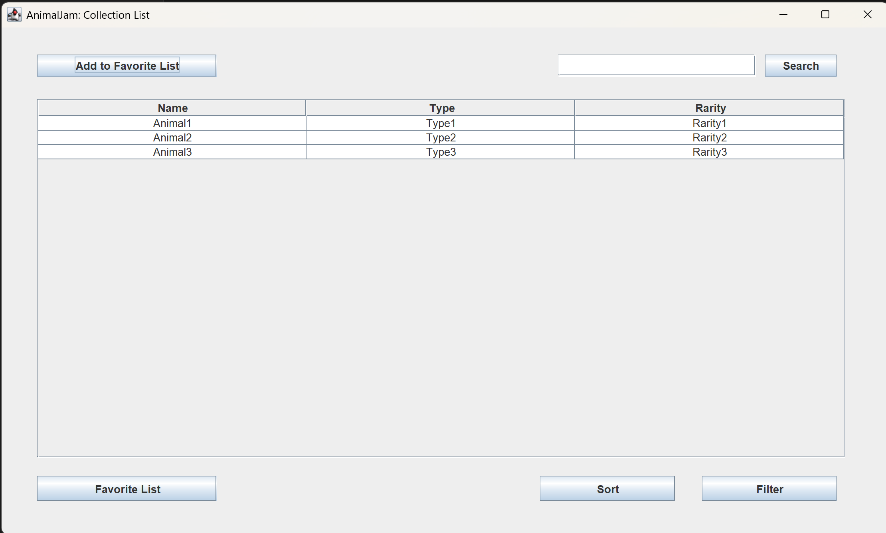
- This test shows the collection display of the app.

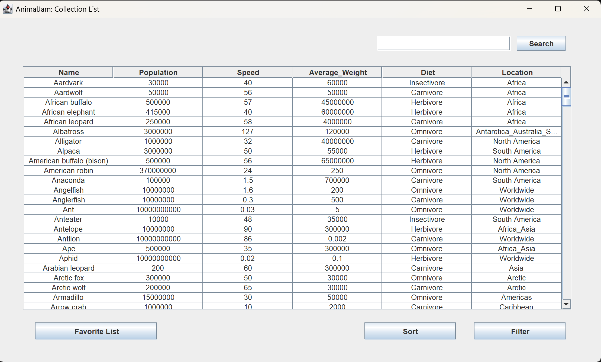
- This test shows the collection display of the app with data from database.

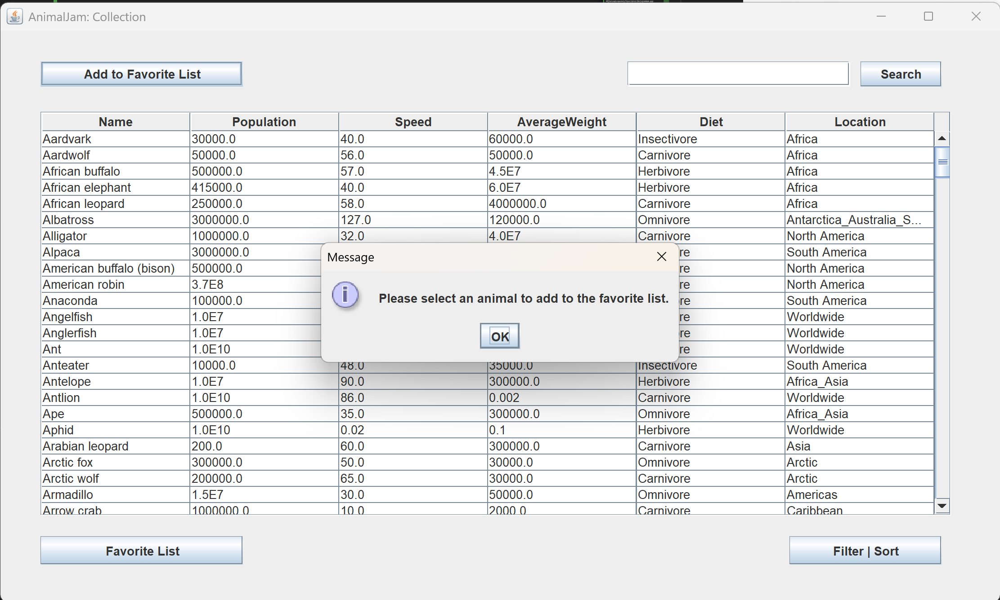

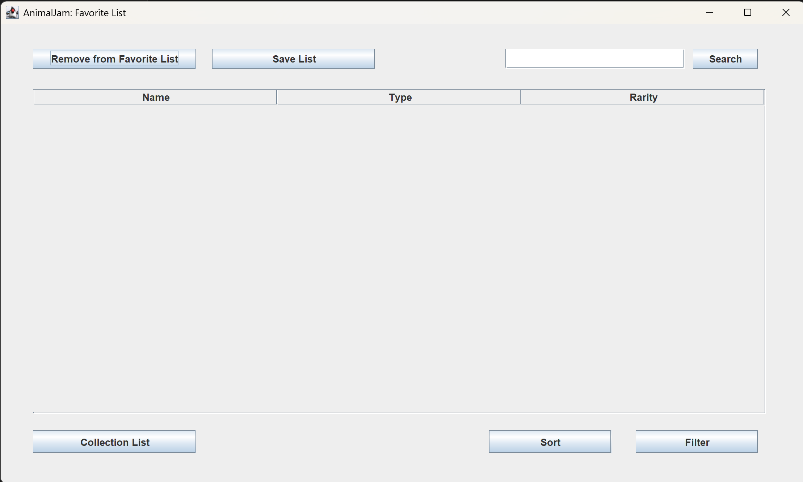
- This test shows the favorite list of the app.

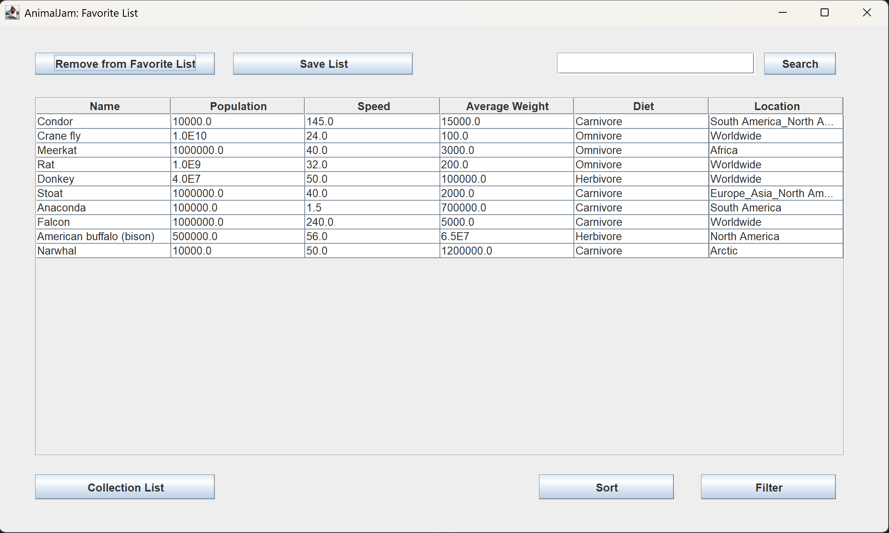
- This tests shows the favorite list of the app with multiple animals added from collection at once.

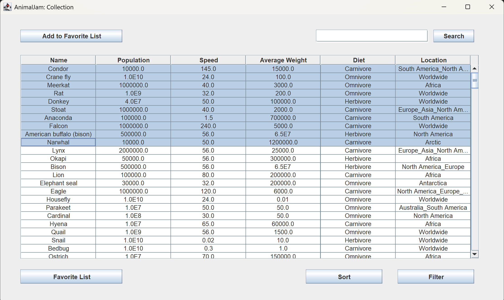
- This tests shows the favorite list of the app with multiple animals selected.

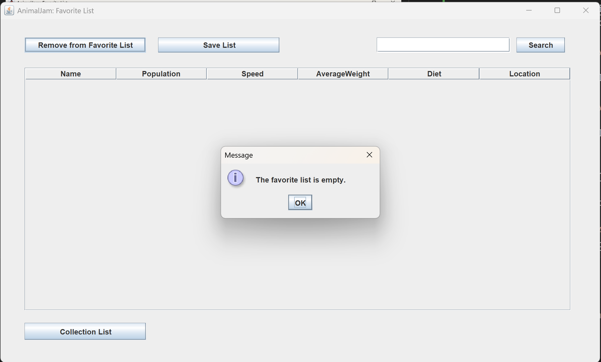
- This tests shows the favorite list prompt when the list is empty.

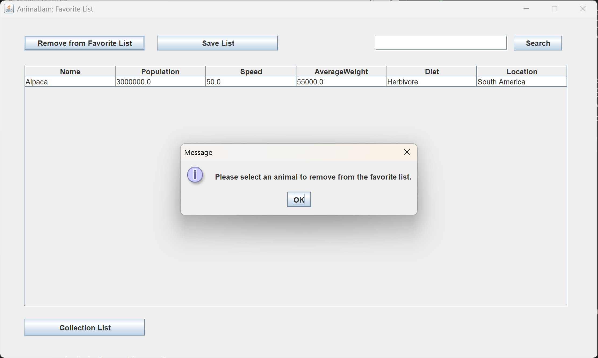
- This tests shows the favorite list prompt when no animals were selected to be removed.

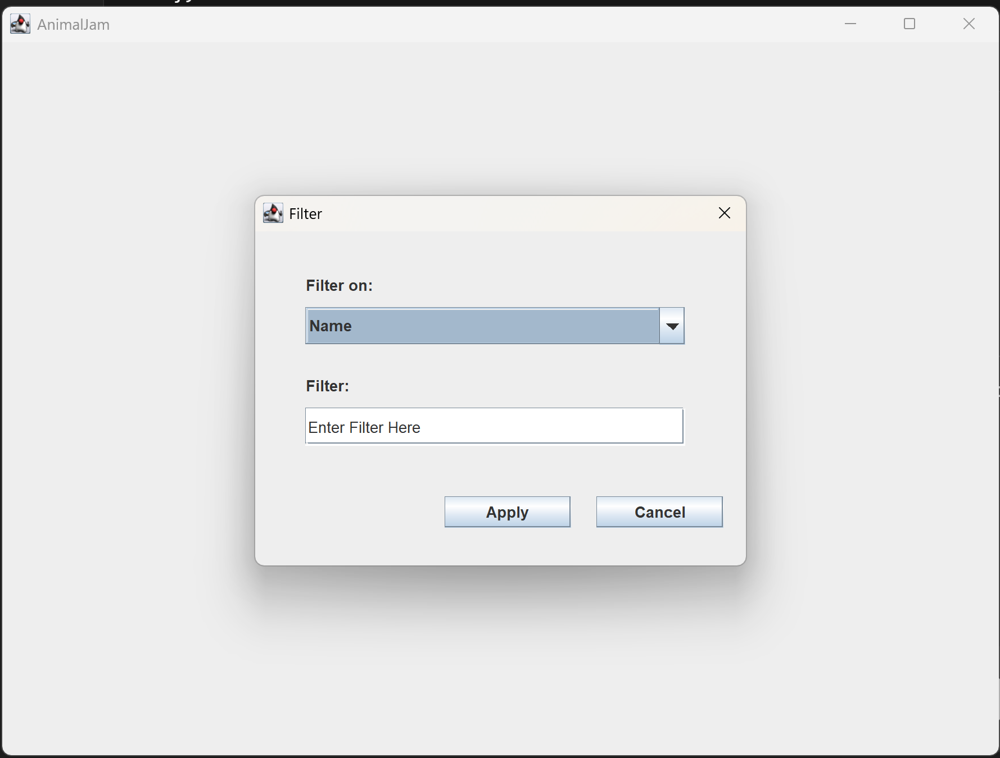
- This test shows the initial filter display of the app.

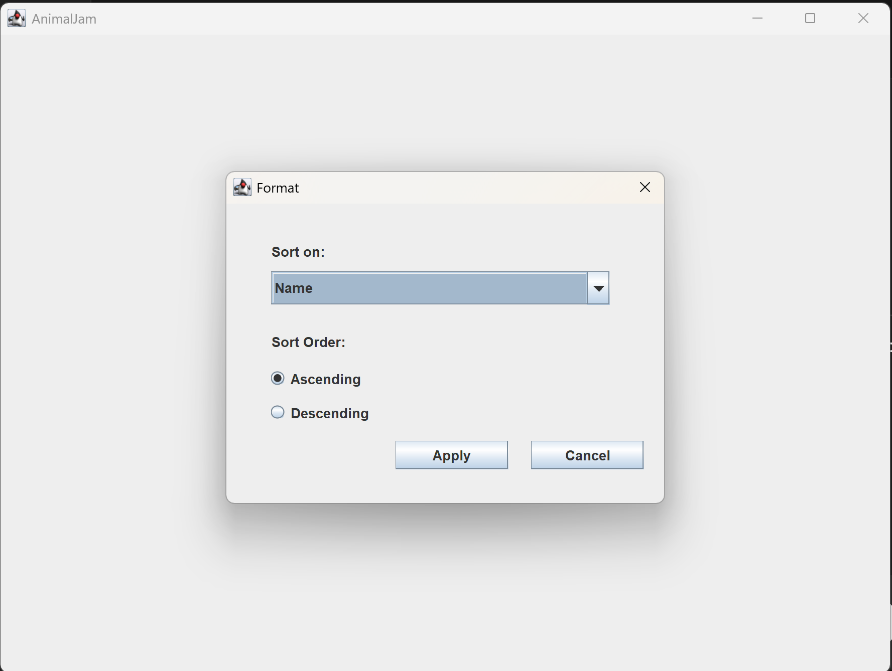
- This test shows the sort options to be added to the filter display of the app.

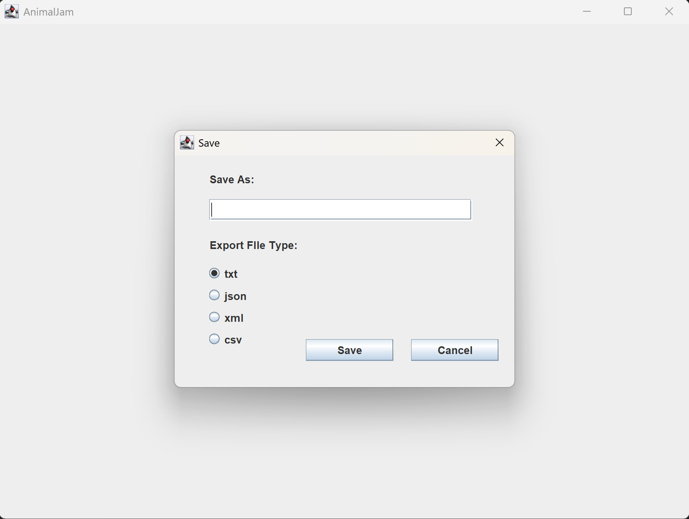
- This test shows the save display of the app.

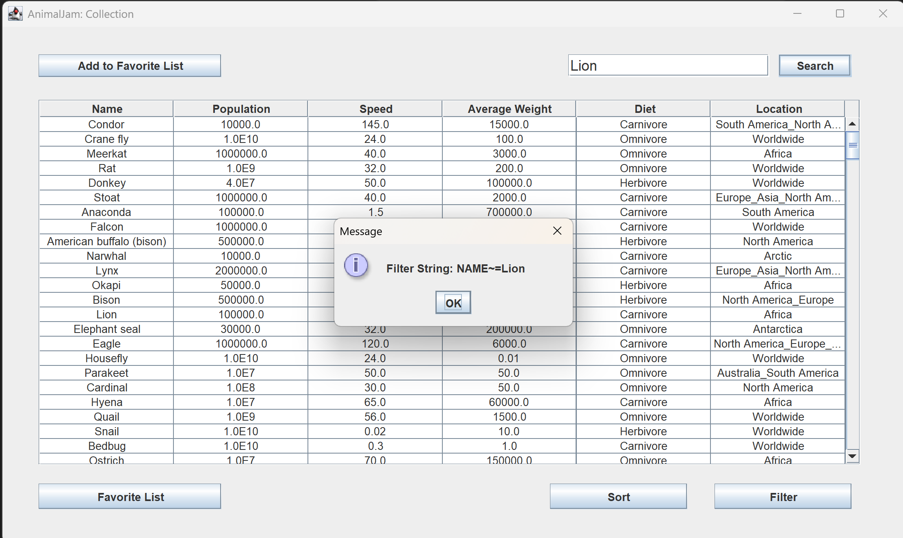
- This test shows the that the inputted filter string is being retrieved from the search bar.

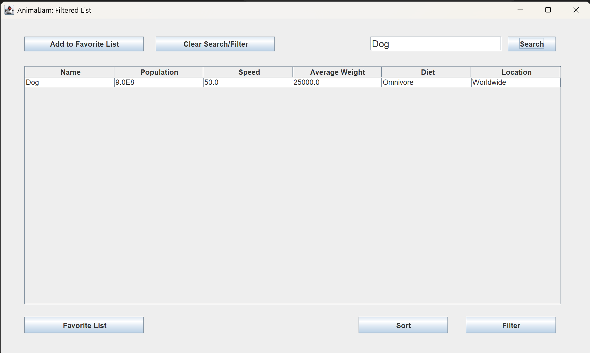
- This test shows the search working on the Collection list.

