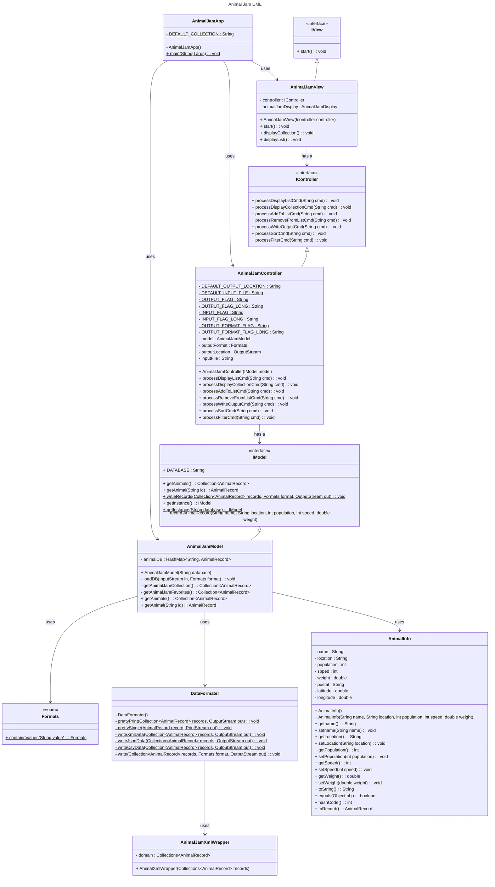

# Final Project Proposal

This document summarizes the final project deliverables.

## Project Proposal Details

Please refer to Powerpoint presentation in Desgin Documents folder: Final_Project_Proposal.ppt

## (INITIAL DESIGN): Class Diagram

