# Manual 

## Welcome Screen

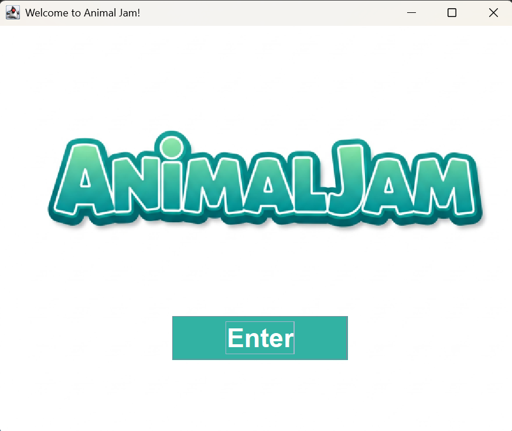
- The welcome screen is the first screen that users see when they open the app. Users can click the "Enter" button to proceed to the main collection screen of the program.

## Main Collection Screen
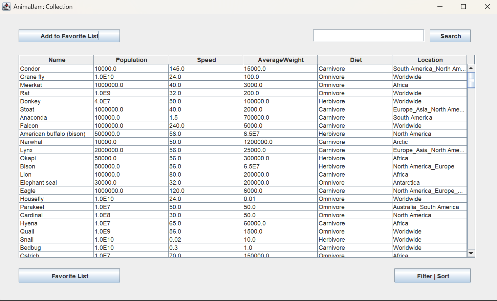
- The main collection screen displays a list of all the Animals available in the app's database. Users are able to utilize multiple features to manage the collections effectively. These include searching for specific animals, filtering the collection based on various criteria, and sorting the collections by different attributes.

### Searching for Animals

- The search panel allows users to find specific animals by entering the animal's name or any part of the name in the search bar. Enter the search term in the search bar and press the "Search" button to initiate the search. The app will display the results in the main collection screen as a filtered list of animals.

### Add To Favorites
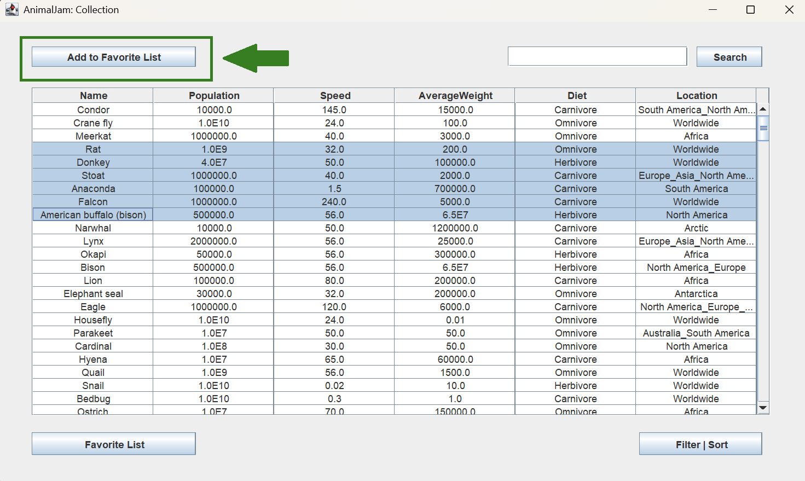
- Users can add animals to their favorites list by selecting the animal or animals and clicking the "Add to Favorite List" button. This will add the selected animal/s to the user's favorites list.

### View Favorites
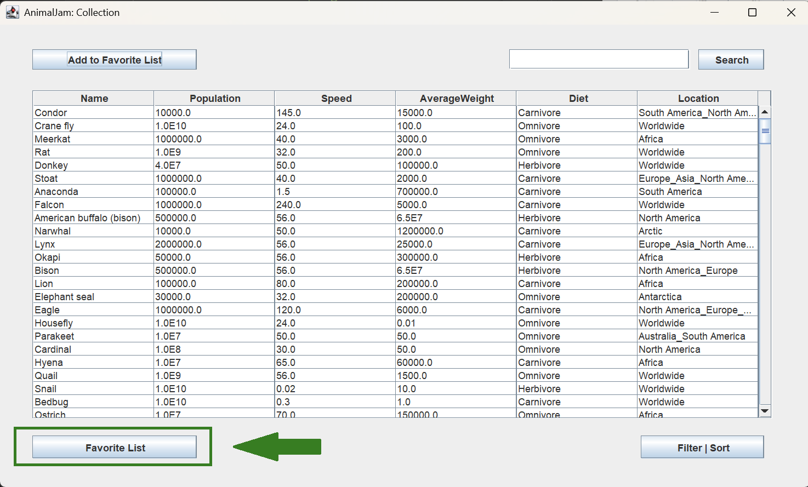
- Users can view their favorites list by clicking the "Favorite List" button. This will take them to a new screen that displays all the animals they have added to their favorites list. It will also make available the "Remove from Favorite List" button to remove animals from the favorites list and the Save. 

#### Favorite List Screen
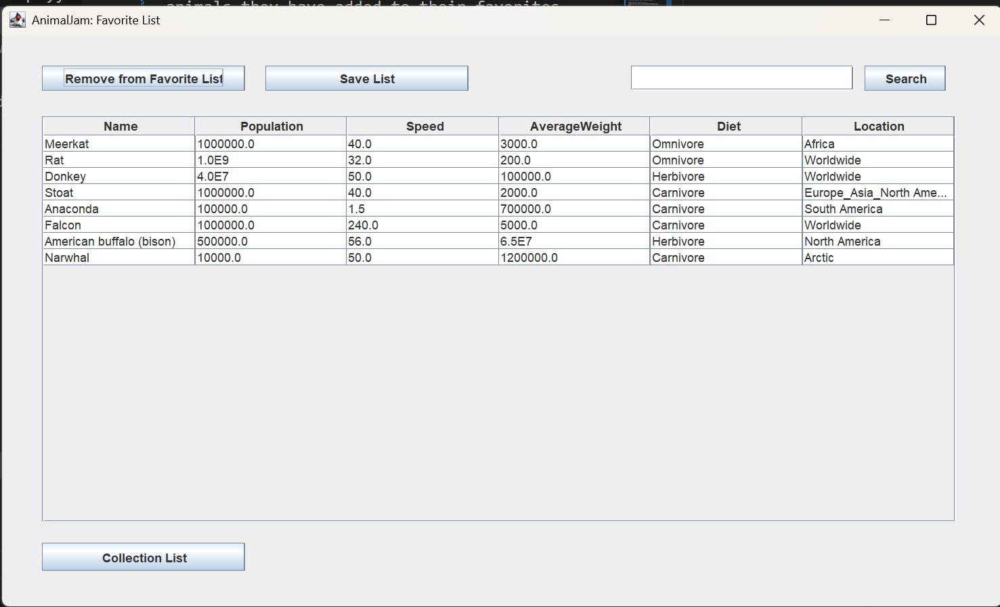
- On the Favorite List screen, the favorite list will be displayed, along with the Remove from list button and the save button. 

##### Remove From Favorites
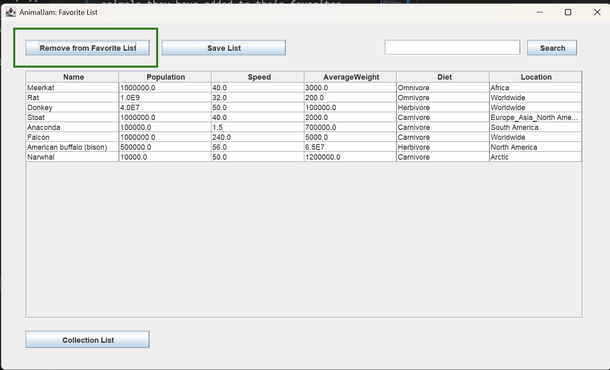
Users can select the animal or animals they want to remove and click the "Remove from Favorite List" button. This will remove the selected animal/s from the user's favorites list.

##### Save Favorite List
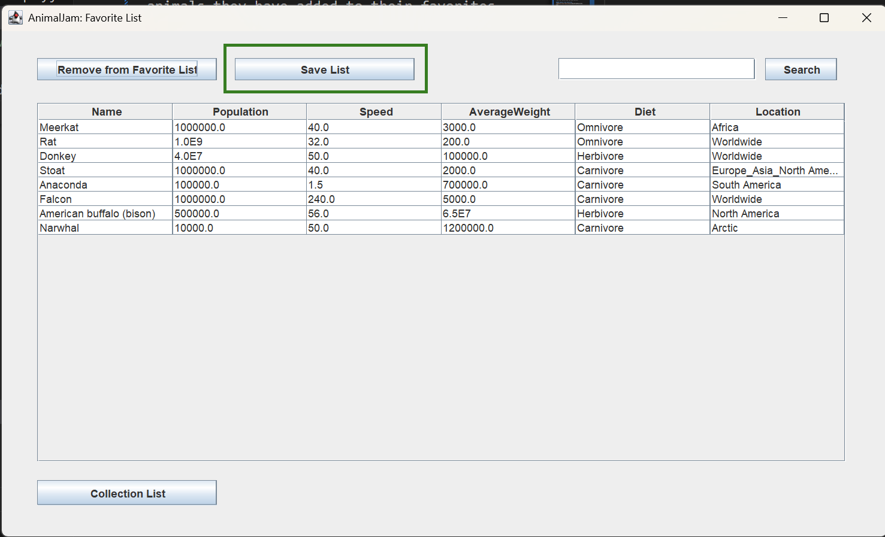
- Users can save their favorite list by clicking the "Save" button. This will save the current state of the favorites list to a file, allowing users to keep track of their favorite animals even after closing the app.

##### Go Back to Collection List
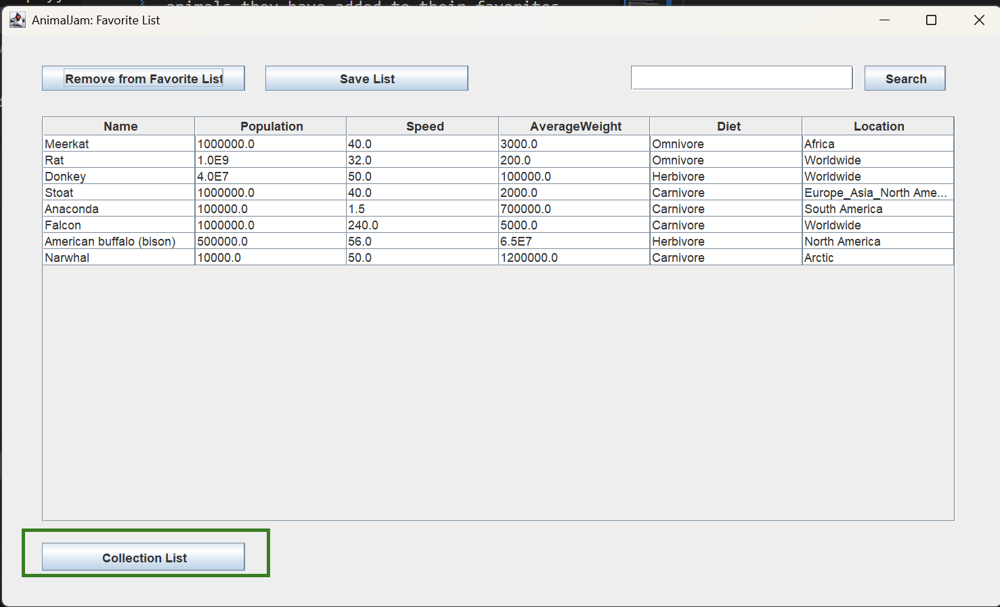
- Users can return to the main collection screen by clicking the "Collection List" button. This will take them back to the main collection screen, where they can continue managing their collections.

### Filtering or Sorting Animals
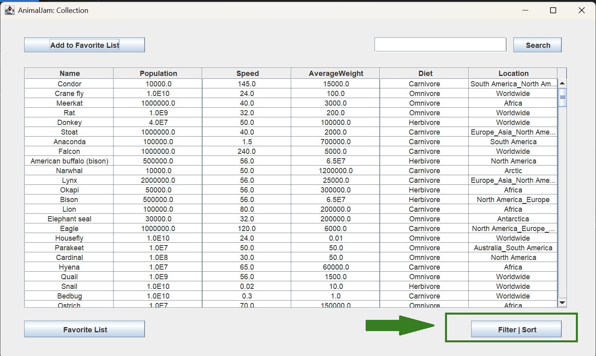
- The filter panel allows users to narrow down the list of animals based on specific criteria. To start filtering and sorting, click the "Filter" button. A new panel will appear with various filter options. 

#### Filter And Sort Options
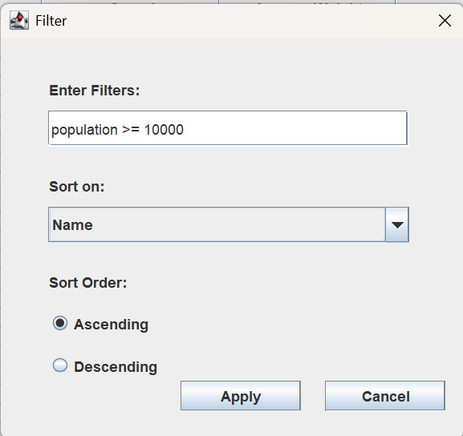
Users can add filter strings into the Filter textbox to apply them. They should be in the form:

 &ltcolumnName> &ltoperation> &ltvalue> 

- \<columnName> is the name of the column to filter on (e.g., "Name", "Population", etc.).
- \<operation> is the comparison operator. It can be one of the following:   
    - "==" : equals 
    - "<"  : less than
    - ">"  : greater than
    - "<=" : less than or equal to
    - ">=" : greater than or equal to
    - "!=" : not equal to
    - "~=" : contains

- \<value> is the value to compare against. It should be a valid value for the specified column.  

For example, to filter animals with a population greater than 10000, the filter string would be: 
`Population > 10000`

Multiple filters can be applied at once by separating them with a comma. For example, to filter animals with a population greater than 10000 and a name that contains "lion", the filter string would be: 
`Population > 10000, Name ~= lion`

The user then uses the Sort On dropdown to select the column to sort the results of the filter and the order radio buttons to select the order of the sort. Name and ascending order are selected by default and can be left as is.  

**Note:** To only sort the collections list, leave the filter Textbox emply, select the column to sort on, the order of the sort, and click the "Apply" button. The app will sort the list based on the selected column and order.

##### Filtered List
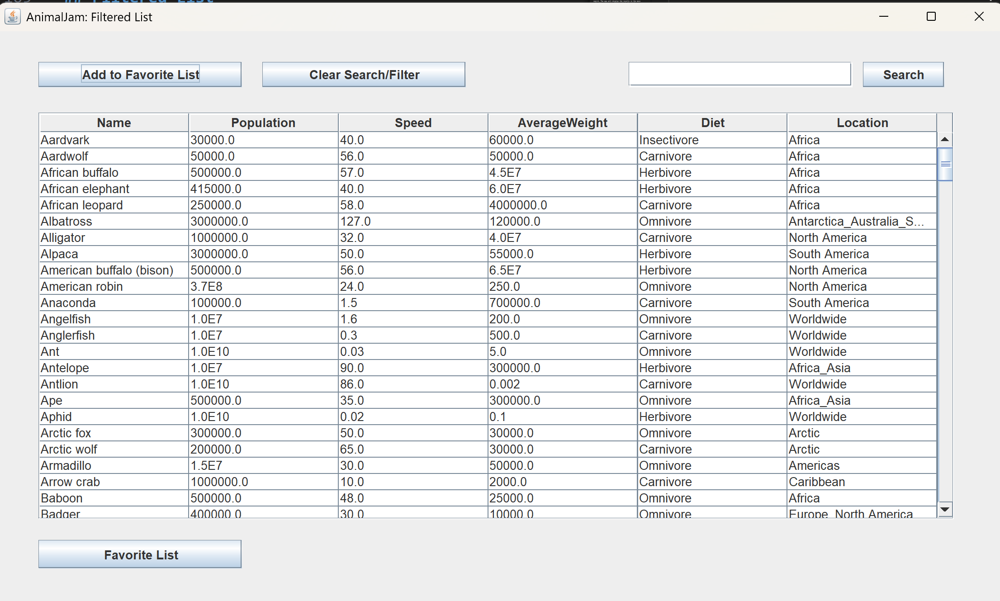
- The results of the filter will show up in the main collection screen as a filtered list of animals. The filtered list will only display animals that match the specified filter criteria. You can clear the filter by clicking the Clear Filter or Search button or just going back to the main collection screen. The app will reset the filter and display all animals in the collection again.

